# Getting Started

Here you will learn how to install and run the application. In our project we use React Native CLI. We will launch the application on **Android** and **iOS**.

## Android

You will need *Node*, *the React Native command line* interface, a *JDK*, and *Android Studio*.

### Step 1: Install Node, JDK

   1. Download an LTS version of [Node](https://nodejs.org/ru).
   >**Note**: If you have already installed Node on your system, make sure it is Node 16 or newer
   2. Download [Java SE Development Kit (JDK) 11](https://www.techspot.com/downloads/5553-java-jdk.html)
   >**Note**: If you have another JDK version in your PC go to *Windows → Settings → Applications* and delete  old version.

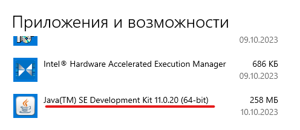

   Then go to *C:\Program Files\Java* and delete JDK folder.

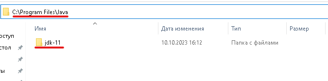

### Step 2: Install and setup Android Studio

#### Install Android Studio

Download and install *Android Studio*. While on *Android Studio* installation wizard, make sure the boxes next to all of the following items are checked:

 * **Android SDK**
 * **Android SDK Platform**
 * **Android Virtual Device**

Then, click "Next" to install all of these components.

#### Install the Android SDK

Open Android Studio, click on "More Actions" button and select "SDK Manager".

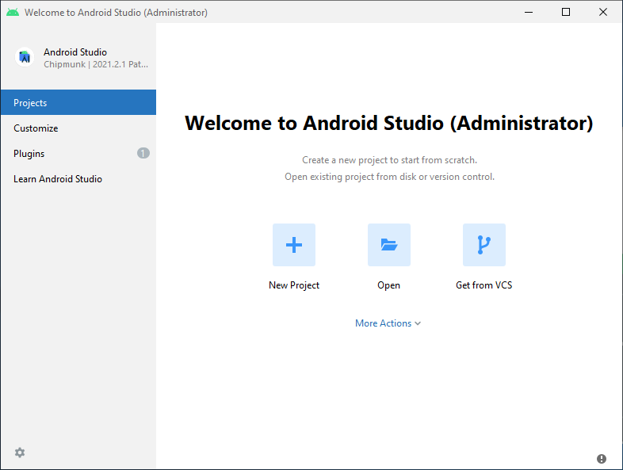

>**Note**: The SDK Manager can also be found within the Android Studio "Settings" dialog, under Languages & Frameworks → Android SDK.

Select the "SDK Platforms" tab from within the SDK Manager, then check the box next to "Show Package Details" in the bottom right corner. Look for and expand the Android 13 (Tiramisu) entry, then make sure the following items are checked:

* Android SDK Platform 33 or 34
* Intel x86 Atom_64 System Image
* Google APIs Intel x86 Atom System Image*

Next, select the "SDK Tools" tab and check the box next to "Show Package Details" here as well. Look for and expand the Android SDK Build-Tools entry, then make sure that 33.0.0 or 34.0.0 is selected.

Finally, click "Apply" to download and install the Android SDK and related build tools.

### Step 3: Configure environment variables

#### ANDROID_HOME variable

The React Native tools require some environment variables to be set up in order to build apps with native code.

* In search panel window write **"Control Panel"**.
* Click on **User Accounts**, then click **User Accounts** again
* Click on **Change my environment variables**
* Click on **New...** to create a new ANDROID_HOME user variable that points to the path to your Android SDK:

 

You can find the actual location of the SDK in the Android Studio "Settings" dialog, under Languages & Frameworks → Android SDK.

>**Note**: If you have already opened a project in Android Studio, You can find the actual location of the SDK in top panel Tools → SDK Manager → Languages & Frameworks → Android SDK.

#### Add platform-tools to Path
* In search panel window write **"Control Panel"**.
* Click on **User Accounts**, then click User Accounts again
* Click on **Change my environment variables**
* Select the **Path** variable.
* Click **Edit**.
* Click **New** and add the path to platform-tools to the list.

The default location for this folder is:

> %LOCALAPPDATA%\Android\Sdk\platform-tools

### Step 4: Prepare the Android device

Go to Android Studio and open android folder in our Reacte Native project.

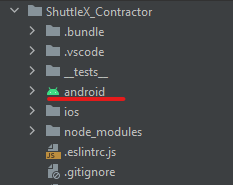

Find icon in right panel of Android Studio and click on it.


Choose *Virtual tab*. Then tap on button **Create device**.

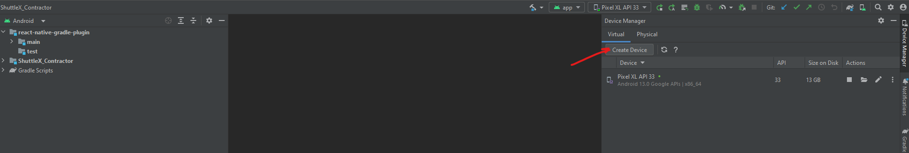

Choose any device in phone category and click next.

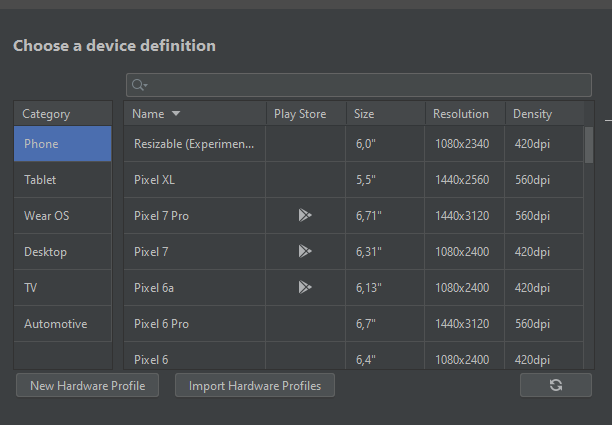

Click on tab on x86 Images and choose **Tiramisu**. Click Next.

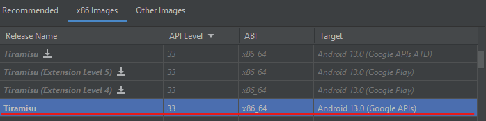

Name the device and click on **Finish**.

Run this device.

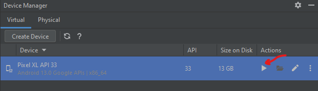

Result:

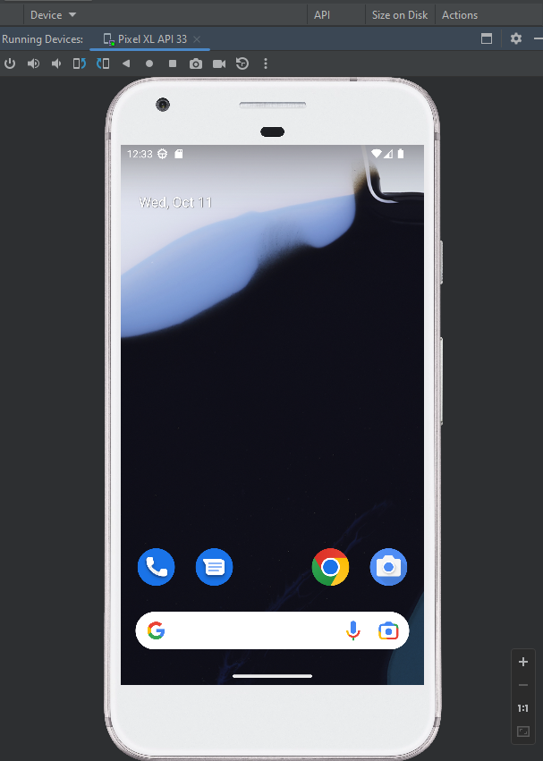

### Step 5: Start your Application

In your text editor open a terminal from the _root_ of your React Native project. Run the following command to start your _Android_ app:

```bash
# using npm
npm i
npm start
```
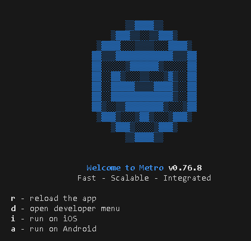

Press the **a** key to run app on Android.

>**Note**: If you start with new JDK version open terminal and write ```npm start -- --reset-cache```

### Congratulations!

You've successfully run and modified your React Native App.

>**Note**: Additional information about the installation can be found in the official documentation [Reacte Native](https://reactnative.dev/docs/environment-setup?os=windows&platform=android)

## For iOS

You need to install **Mac Os** and then setup **XCode**. To install mac Os we will use virtual machine **"VirtualBox"**.

### Step 1: Install VirtualBox
 * Go to [VirtualBox page](https://www.virtualbox.org/wiki/Downloads). Choose *Windows Hosts*. Then go through the installation.
 * Go to [VirtualBox page](https://www.virtualbox.org/wiki/Downloads) again and download **All supported platforms**.

### Step 2: Install Mac OS
You will see how to install Mac Os on this [video](https://www.youtube.com/watch?v=7HNWj_GMAOY&t=92s).

Files for install:
   * [Mac OS BigSur 11.6.8](https://drive.google.com/drive/folders/16G1d_XnOOppaervgbi00isNpzprupvCT)

   * [Mac Os files](https://drive.google.com/file/d/1oTHhUOoJGE21R2UwuoppzMhrGbisI2_Y/view)

   >**Note**: Allocate to disk memory 100GB.

### Step 3: Install Xcode

* Get Apple ID from [ICloud](https://www.icloud.com/). Click to *login → Crate Aplle ID*. Register and remember your *Apple ID*.

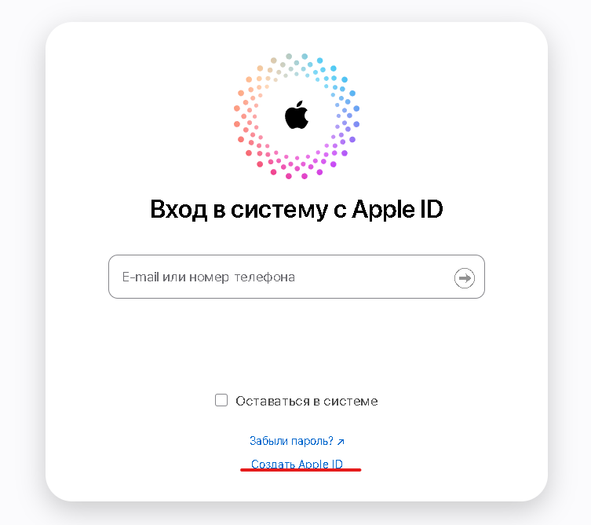

* In your Mac Os system go to [XCode Page](https://developer.apple.com/download/release/), enter your Apple ID and download XCode 12.5.1

### Step 4: Installing dependencies

* Install [Visual Studio Code](https://code.visualstudio.com/) in you Mac Os system.

* Install [Homebrew](https://brew.sh/), write this command in console
   ```
   /bin/bash -c "$(curl -fsSL https://raw.githubusercontent.com/Homebrew/install/HEAD/install.sh)"
   ```

* Install **Node** and **WatchMan**, write this commands
   ```
   brew install node
   brew install watchman
   ```

* Open Xcode, then choose Preferences from the Xcode menu. Go to the Locations panel and install the tools by selecting the most recent version in the Command Line Tools dropdown.


* To install a simulator, open Xcode > Preferences and select the Platforms (or Components) tab. Select a **Simulator 14.0 iOS or higher**.

### Step 5: Cocoapods and ruby installation

* Install latest version of ruby using [rbenv](https://github.com/rbenv/rbenv)
  1. Install rbenv using brew
      ```
      brew install rbenv ruby-build
      ```

  2. Learn how to load rbenv in your shell
      ```
      # run this and follow the printed instructions:
      rbenv init
      ```

  3. Close your Terminal window and open a new one so your changes take effect

  4. Check list of ruby versions and find latest (now it's 3.2.2)
      ```
      rbenv install -l
      ```

  5. Install latest ruby version
      ```
      rbenv install <version number>
      ```

  6. Set a Ruby version globally to finish installation:
      ```
      rbenv global <version number>
      ```

* Open project and in terminal go to **ios folder**.
   ```
   cd ios
   ```

* Install [Cocoapods](https://cocoapods.org/) by command

   ```
   sudo gem install cocoapods
   ```

* Install [Bundle](https://bundler.io/) by command

   ```
   bundle install
   ```
* Install Pods by command

   ```
   bundle exec pod install
   ```

### Step 6: Running your React Native application
   In your text editor open a terminal from the _root_ of your React Native project. Run the following command to start your _iOS_ app:

   ```bash
   npm start
   # then press i
   ```

### Congratulations!

You've successfully run and modified your React Native App.

>**Note**: Additional information about the installation can be found in the official documentation [Reacte Native](https://reactnative.dev/docs/environment-setup?os=macos&platform=ios).

## License

ShuttleX Inc. license

---

Made with [create-react-native-library](https://github.com/callstack/react-native-builder-bob)